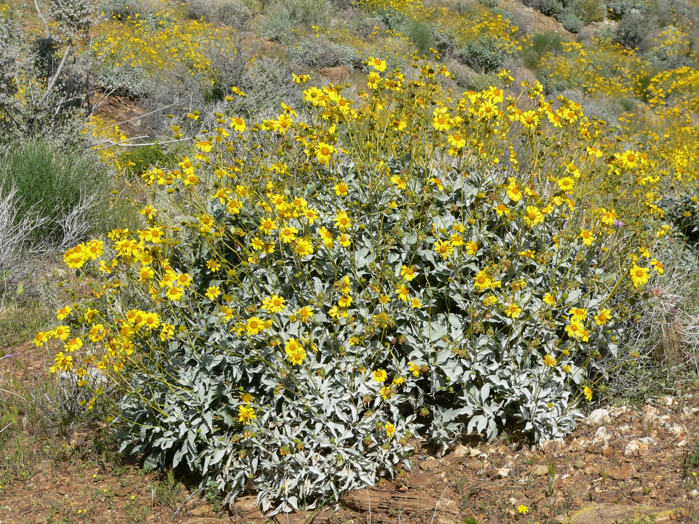
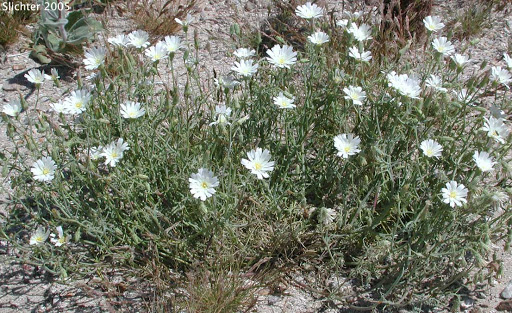

```{r setup, include=FALSE}
knitr::opts_chunk$set(echo = FALSE, results = FALSE, message=FALSE, warning=FALSE, cache=TRUE)
```


# Climate Change's Effect on Plant Species

Lukas Robinson \| Chris Merkord

Biosciences Department, Minnesota State University Moorhead, 1104 7th Avenue South, Moorhead, MN 56563 USA

## Abstract

The Botanical Information and Ecology Network (BIEN) brings together data on plant distribution, abundance, and traits, with the goal of predicting the effects of climate change on plant species.
This project will analyze how the distribution, abundance, elevation, and latitude of three different plant species found in the Arizona and California area change over two decades.

The data being used in this project was collected from the BIEN package found in RStudio.
Different graphs were made with this data to summarize how climate change has affected these certain plant species over time.

I found that as Arizona and California's climates change over time and get warmer some plant species could be migrating to higher elevations to reach a cooler climate.

## Introduction

Climate change here on Earth is at an alarming stage, with a steady increase in atmospheric carbon dioxide affecting how plants photosynthesis, to the unbalanced situations in climatic conditions, some places prolonged droughts and in others increased flooding.
These issues are causing major problems for plant species worldwide.

Climate change is defined as a long-term change in the average weather patterns that have come to define Earth's local, regional and global climates.
Just with this definition, we can hypothesis that as climate change slowly changes Earth's local, regional and global climates plant species will be affected in some way but how?

To show how climate change is effecting these plants I will be taking three different species and examine how their abundance, distribution, elevation, and latitudes change over two decades.






Figure 1.
This shows the three plant species being observed in this experiment.
Encelia Farinosa (top) and are very common, Phacelia Distans (middle) found typically between 1,000 and 4,000 feet, and Rafinesquia Neomexicana (bottom) found typically between 200 and 3,000 feet.
Source azstateparks.com

## Methods

### Data Acquisition

For this project, all the data was analyzed and manipulated using RStudio (RStudio Team 2020).
The plant species latitude, date collected, and year data were acquired from the Botanical Information and Ecology Network (BIEN 2021).
This data was obtained using the R package known as BIEN (Maitner, 2020).
The elevation data used in this experiment was acquired from the elevatr package (Hollister J.W. 2020) found in RStudio.

No special access was required to access these resources I just needed to download the packages into R Studio before being able to look at the data.
azstateparks.com was used to narrow down the search for a good plant species to study.

### Data Preparation

After first loading in all of the required packages, data was first prepared for analysis by filtering through all the plant species in the BIEN package to only the three plant species being observed in this project.

Once the species were filtered out the three data sets were then bound together into one and simplified into a data set to only have the categories needed for my research.
The categories include species, date collected, year, and geometry.
By doing this it helped me better understand how large my sample size will be for this experiment.

After this new data set was created, the two states that were being examined were filtered out to only show California and Arizona.
Once that was done the data was graphed into three separate rows and columns.
This showed what the distribution looked like of the three plant species over the three given years.

Next, the elevatr package was used to get each elevation point for the plant species found in the data set.
This was done by filtering each plant species individually then binding those data sets together.
Then calculate the mean, standard deviation, sample size, standard error, and the upper and lower limit.
This allowed was then graphed to examine these plant species and see how each of their mean and 95% confidence interval changed over time.

The same process was done to get the latitude graph over time.
The only difference was plugging in latitude instead of elevation then graphing this to see how the mean latitude of these species has changed.

## Results

```{r}
library(tidyverse)
library(BIEN)
library(ape)
library(maps)
library(sp)
library(lubridate)
library(sf)
library(elevatr)
library(USAboundaries)
```

```{r}
Encelia_farinosa <-
  BIEN_occurrence_species(species = "Encelia farinosa")

Rafinesquia_neomexicana <-
  BIEN_occurrence_species(species = "Rafinesquia neomexicana")

Phacelia_distans <-
  BIEN_occurrence_species(species = "Phacelia distans")
```

```{r}
all_data <-
  bind_rows(Encelia_farinosa,
            Rafinesquia_neomexicana,
            Phacelia_distans) %>% 
  as_tibble() %>% 
  transmute(
    species = scrubbed_species_binomial,
    latitude,
    longitude,
    date_collected,
    year = as.factor(year(date_collected))
  ) %>% 
  filter(year %in% c(2015, 2005, 1995)) %>% 
  st_as_sf(coords = c("longitude", "latitude"),crs = 4326, remove = FALSE) %>% 
  print()
```

```{r}
map_data("state") %>% 
  filter(region == "arizona") %>% 
  st_as_sf(coords = c("long", "lat"),crs = 4326, remove = FALSE)
```

```{r fig.height=7}
us_states() %>% 
  filter(state_name %in% c("Arizona", "California")) %>% 
  ggplot() + 
  geom_sf() +
  geom_sf(mapping = aes(color = species, shape = year),
          data = all_data) +
  facet_grid(year ~ species) +
  guides(color = "none") +
  guides(shape = "none")
```

Figure 2.
Occurrences of the three plant species in the BIEN data set over time

```{r}
elevation_point<-all_data %>% 
  get_elev_point() 
```

```{r}
Encelia_elevation <-
  filter(elevation_point, species %in% c("Encelia farinosa")) 

Phacelia_elevation <-
  filter(elevation_point, species %in% c("Phacelia distans"))

Rafinesquia_elevation <-
  filter(elevation_point, species %in% c("Rafinesquia neomexicana"))
```

```{r}
all_elevation <-
  bind_rows(Encelia_elevation,
            Rafinesquia_elevation,
            Phacelia_elevation) %>% 
  st_drop_geometry() %>% 
  group_by(species, year) %>% 
  summarize(
    mean_e = mean(elevation),
    sd_e = sd(elevation),
    sample_size = n(),
    sem = sd_e / sqrt(sample_size),
    ci_upper_limit = mean_e + 1.96 * sem,
    ci_lower_limit = mean_e - 1.96 * sem,
  )
```

```{r}
elevation_point %>% 
  filter(!is.na(species)) %>% 
  ggplot() +
  geom_jitter(mapping = aes(x = year, y = elevation, color = year),
              alpha = .5) +
  geom_crossbar(
    data = all_elevation,
    mapping = aes(
      x = year,
      y = mean_e,
      ymax = ci_upper_limit,
      ymin = ci_lower_limit
    ),
    color = "black"
  ) +
  facet_wrap( ~ species) +
  guides(color = "none")
```

Figure 3.
Differences in mean elevation over time of the three plant species.

```{r}
average_latitude <-
  all_data %>% 
  st_drop_geometry() %>% 
  group_by(species, year) %>% 
  summarize(
    mean_l = mean(latitude),
    sd_l = sd(latitude),
    sample_size = n(),
    sem = sd_l / sqrt(sample_size),
    ci_upper_limit = mean_l + 1.96 * sem,
    ci_lower_limit = mean_l - 1.96 * sem,
  ) 
```

```{r}
all_data %>% 
  ggplot() +
  geom_jitter(mapping = aes(x = year, y = latitude, color = year),
              alpha = .5) +
  geom_crossbar(
    data = average_latitude,
    mapping = aes(
      x = year,
      y = mean_l,
      ymax = ci_upper_limit,
      ymin = ci_lower_limit
    ),
    color = "black"
  ) +
  facet_wrap( ~ species) +
  guides(color = "none")
```

Figure 4.
Differences in mean latitude over time of the three plant species.

## Discussion

Figures 3 and 4 show a general increase in the elevations and latitudes of the Phacelia Distans and Rafinesquia Neomexicana plant species over the two decades.
This result is in line with another study looking at the upward elevation and northwest range shifts of alpine plant species (He et al, 2019).
That study stated that climate change could be impacting the distribution of species by shifting their ranges to higher elevations or higher latitudes due to rising temperatures.
This directly correlates with the elevation and latitude data found in the Phacelia and Rafinesquia species observed in this project.

The trend being displayed in figures 3 and 4 suggests that certain plant species could be needing to migrate to other places where the climate fits their needs of survival.
As the climate changes in Arizona and California, the Phacelia and Rafinesquia plant species may be moving to higher elevations to get to a cooler temperature.

The fact that 2 of the 3 species observed in this project showed an increase in their elevation and latitude brings up the question of how many other plant species are being affected by these rising temperatures.
If plant species are needing to migrate to other climates and are unsuccessful in doing so that could have a big impact on the plant biodiversity of some places and hurt ecosystems around the world (Jump et al, 2012).

Although my results are suggestive there are other possible explanations for this outcome.
It could be possible in 2005 and 2015 people only recorded the Phacelia and Rafinesquia species at higher latitudes and elevations causing the means to rise.

## References

1.  Brian Maitner (2020).
    BIEN: Tools for Accessing the Botanical Information and Ecology Network Database.
    R package version 1.2.4.
    <https://CRAN.R-project.org/package=BIEN>

2.  Hadley Wickham, Romain François, Lionel Henry and Kirill Müller (2020).
    dplyr: A Grammar of Data Manipulation.
    R package version 1.0.2.
    <https://CRAN.R-project.org/package=dplyr>

3.  He, X., Burgess, K., Yang, X., Ahrends, A., Gao, L., & Li, D.
    (2019, March 11).
    Upward elevation and Northwest range shifts for Alpine Meconopsis species in The Himalaya–hengduan Mountains region.
    Retrieved April 13, 2021, from <https://onlinelibrary.wiley.com/doi/full/10.1002/ece3.5034>

4.  Hollister, J.W.
    (2020).
    elevatr: Access Elevation Data from Various APIs R package version 0.3.1.
    <https://CRAN.R-project.org/package=elevatr/>

5.  H. Wickham.
    ggplot2: Elegant Graphics for Data Analysis.
    Springer-Verlag New York, 2016.Hollister, J.W.
    (2020).
    elevatr: Access Elevation Data from Various APIs.
    R package version 0.3.1.
    <https://CRAN.R-project.org/package=elevatr/>

6.  Jump, A., Huang, T., & Chou, C.
    (2012, May 03).
    Rapid altitudinal migration of Mountain plants in Taiwan and its implications for high altitude biodiversity.
    Retrieved April 17, 2021, from <https://onlinelibrary.wiley.com/doi/10.1111/j.1600-0587.2011.06984.x>

7.  R Core Team (2020).
    R: A language and environment for statistical computing.
    R Foundation for Statistical Computing, Vienna, Austria.
    URL <https://www.R-project.org/>

8.  RStudio Team (2020).
    RStudio: Integrated Development Environment for R.
    RStudio, PBC, Boston, MA URL <http://www.rstudio.com/>
