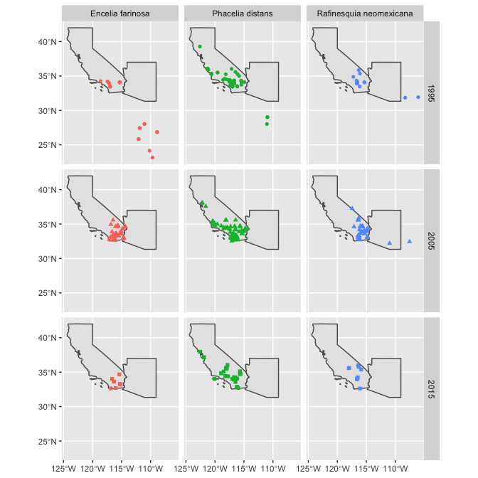
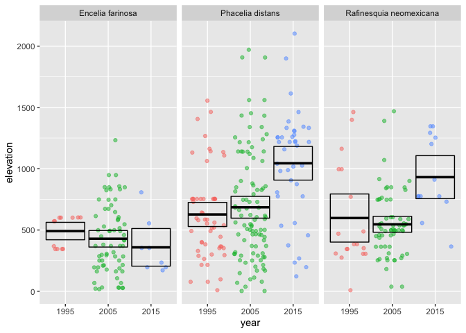
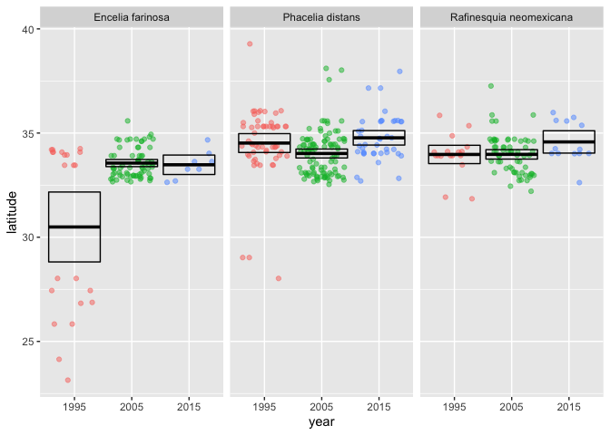

# Climate Change’s Effect on Plant Species

Lukas Robinson

Biosciences Department, Minnesota State University Moorhead, 1104 7th
Avenue South, Moorhead, MN 56563 USA

## Abstract

The Botanical Information and Ecology Network (BIEN) brings together
data on plant distribution, abundance, and traits, with the goal of
predicting the effects of climate change on plant species. This project
will analyze how the distribution, abundance, elevation, and latitude of
three different plant species found in the Arizona and California area
change over two decades.

The data being used in this project was collected from the BIEN package
found in RStudio. Different graphs were made with this data to summarize
how climate change has been affecting these certain plant species over
time.

## Introduction

Climate change here on Earth is at an alarming stage, with a steady
increase in atmospheric carbon dioxide affecting how plants
photosynthesis, to the unbalanced situations in climatic conditions,
some places prolonged droughts and in others increased flooding. These
issues are causing major problems for plant species worldwide.

Climate change is defined as a long-term change in the average weather
patterns that have come to define Earth’s local, regional and global
climates. Just with this definition, we can hypothesis that as climate
change slowly changes Earth’s local, regional and global climates plant
species will be affected in some way but how?

To show how climate change is effecting these plants I will be taking
three different species and examine how their abundance, distribution,
elevation, and latitudes change over two decades.

Figure 1. This shows the three plant species being observed in this
experiment. Encelia Farinosa (left) and are very common, Phacelia
Distans (middle) found typically between 1,000 and 4,000 feet, and
Rafinesquia Neomexicana (right) found typically between 200 and 3,000
feet.

## Methods

### Data Acquisition

For this project, all the data was analyzed and manipulated using
RStudio (RStudio Team 2020). The plant species latitude, date collected,
and year data were acquired from the Botanical Information and Ecology
Network (BIEN 2021). This data was obtained using the R package known as
BIEN (Maitner, 2020). The elevation data used in this experiment was
acquired from the elevatr package (Hollister J.W. 2020) found in
RStudio.

No special access was required to access these resources I just needed
to download the packages into R Studio before being able to look at the
data. azstateparks.com was used to narrow down the search for a good
plant species to study.

### Data Preparation

After first loading in all of the required packages, data was first
prepared for analysis by filtering through all the plant species in the
BIEN package to only the three plant species being observed in this
project.

Once the species were filtered out the three data sets were then bound
together into one and simplified into a data set to only have the
categories needed for my research. The categories include species, date
collected, year, and geometry. By doing this it helped me better
understand how large my sample size will be for this experiment.

After this new data set was created, the two states that were being
examined were filtered out to only show California and Arizona. Once
that was done the data was graphed into three separate rows and columns.
This showed what the distribution looked like of the three plant species
over the three given years.

Next, the elevatr package was used to get each elevation point for the
plant species found in the data set. This was done by filtering each
plant species individually then binding those data sets together. Then
calculate the mean, standard deviation, sample size, standard error, and
the upper and lower limit. This allowed was then graphed to examine
these plant species and see how each of their mean and 95% confidence
interval changed over time.

The same process was done to get the latitude graph over time. The only
difference was plugging in latitude instead of elevation then graphing
this to see how the mean latitude of these species has changed.

## Results

<!-- -->

Figure 2. A map displaying the distributions of the three plant species
in Arizona and California for the years 1995, 2005, and 2015.

<!-- -->

Figure 3. A jitter plot displaying the different elevations and means of
the three plant species over the years 1995, 2005, and 2015.

<!-- -->

Figure 4. A jitter plot displaying the different latitudes and means of
the three plant species over the years 1995, 2005, and 2015.

## Discussion

Figure 3 and 4 shows a general increase in the elevations and latitudes
of the Phacelia Distant and Rafinesquia Neomexicana plant species over
the two decades. In a research article dedicated to looking at the
upward elevation and northwest range shifts of alpine plant species it
stated that “climate change may impact the distribution of species by
shifting their ranges to higher elevations or higher latitudes”
(Burgress et al, 2019). This directly correlates with the elevation and
latitude data found in the Phacelia and Rafinesquia species observed in
this project.

The trend being displayed in figures 3 and 4 proves that certain plant
species are needing to migrate to other places where the weather fits
their needs of survival. This means that climate change is certainly
changing the average weather patterns of Earth’s global climate and
affecting plant species worldwide. As the temperature in Arizona and
California keeps rising the Phacelia and Rafinesquia plant species are
moving to higher elevations to get to a cooler temperature in order to
thrive

## References

1.  Brian Maitner (2020). BIEN: Tools for Accessing the Botanical
    Information and Ecology Network Database. R package version 1.2.4.
    <https://CRAN.R-project.org/package=BIEN>

2.  RStudio Team (2020). RStudio: Integrated Development Environment for
    R. RStudio, PBC, Boston, MA URL <http://www.rstudio.com/>

3.  Hollister, J.W. (2020). elevatr: Access Elevation Data from Various
    APIs. R package version 0.3.1.
    <https://CRAN.R-project.org/package=elevatr/>

4.  R Core Team (2020). R: A language and environment for statistical
    computing. R Foundation for Statistical Computing, Vienna, Austria.
    URL <https://www.R-project.org/>

5.  Wickham et al., (2019). Welcome to the tidyverse. Journal of Open
    Source Software, 4(43), 1686, <https://doi.org/10.21105/joss.01686>

6.  He, X., Burgess, K., Yang, X., Ahrends, A., Gao, L., & Li, D. (2019,
    March 11). Upward elevation and Northwest range shifts for Alpine
    Meconopsis species in The Himalaya–hengduan Mountains region.
    Retrieved April 13, 2021, from
    <https://onlinelibrary.wiley.com/doi/full/10.1002/ece3.5034>
